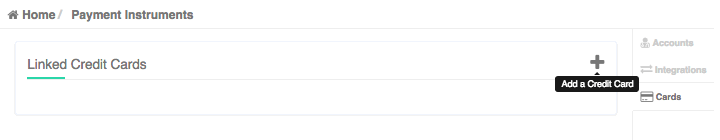

page_title: Shippable CI Billing
page_description: How to update Subscription CI Plan and add more containers
page_keywords: ci billing, add containers, subscription settings, CI/CD, shippable CI, documentation, shippable, config, yml

# CI Subscription Billing

This page explains how to update your CI plan from the Billing Tab.

## How do you get here?

- Login to [Shippable](http://shippable.com)
- Click on **CI** on the landing page
- Click on a specific subscription from the dropdown
- Click on the **Billing** tab from the Subscription dashboard

## Subscription Billing

This is where you can upgrade your subscription plan and edit your number of containers.

### Pre-requisite

Before you can add containers, you need atleast one valid payment method in your account. To add a payment method to your account, follow the steps below:

- Click on Account Settings on the top nav bar

     

- Click on the **Cards** tab
- Add a new payment method by clicking on the 

### Upgrade Plan

- Your plan is automatically set to `mt-ci`, which is our multi-tenant plan. You can also choose to join our Single Tenant CI Beta by choosing `st-ci-beta`. This plans allows you to attach your own build hosts as opposed to running builds on Shippable's infrastructure.
- Use the slider to select the number of containers you want for your subscription
- The total price automatically updates to reflect the price you will pay for the number of containers chosen
- Enter your payment details
- Click the **Buy** button (see pre-requisite above)
- Your CI Plan is now updated and the number of minion count on your Subscriptions dashboard should reflect the new number of containers on your plan

**Note:**
When you downgrade a plan or decrease the number of containers, an adjustment is applied to the next billing cycle.

## Invoices

You can view or download your past invoices in this section. Click on `download` to download any invoice to your local computer.
