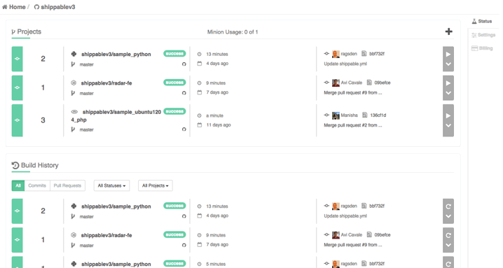
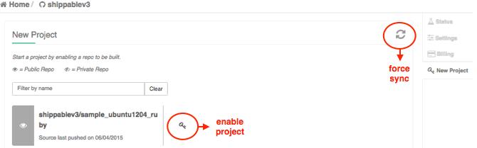

page_title: Shippable CI/CD Dashboard
page_description: Explanation of the CI/CD Dashboard
page_keywords: ci/cd dashboard, subscription settings, CI/CD, shippable CI/CD, documentation, shippable, config, yml

## Subscriptions, Projects & Builds

## Subscription Dashboards

- Login to [Shippable](http://shippable.com)
- Click on **CI** on the Shippable Landing page
- Click on a subscription from the dropdown
- This will bring you to the **Status** page that is also referred to as the Subscriptions Dashboard

*****

## Default View

The default view when you get to the subscriptions dashboard is a list of your enabled projects. The view includes information about the following:

- Who enabled the project and when
- The active branch for the project
- Duration of the latest build for a project
- Status of the latest build for a project
- Change Set Info
- Committer Info

*****

## Enable a New Project

- Click on the  icon to the right of the header bar to enable a new project.
- This brings you to the page with the list of projects in your repo that are yet to be enabled.
- Click on the  icon to enable the project
- If you have recently added a project to github/bitbucket and it is not showing up on the new projects list, click on the **force sync** icon to sync your source code repo with Shippable.

*****

## Minion Usage

This indicates the number of minions or containers currently in use. It will also indicate the maximum number of containers available as per your subscription plan.

