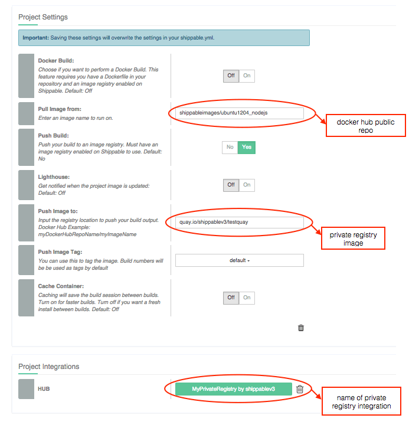

page_title: Docker registries support overview
page_description: This section describes Shippable's support for common Docker registries and enabled scenarios
page_keywords: shippable, Docker, Container, docker hub, docker registry, google container registry, gcr, private docker registry, quay.io

# Overview

Shippable is the world's only CI/CD platform built natively on Docker. Since all your builds run on Docker containers, it gives us a unique ability to support advanced Docker workflows.

One of the most important decisions when using Docker for development is figuring out where to store and manage your Docker images. You can choose to run your own private registry, or pick from the following hosted options:
 * [Docker Hub](https://hub.docker.com/account/signup/)
 * [Google Container Registry](https://cloud.google.com/tools/container-registry/)
 * [Quay.io](https://quay.io/repository/)
 * Any Private Docker Registry with a publicly accessible URL

Once you've zeroed down on the registry option that fits your needs, you can configure Shippable to pull images from and push images to your registry as part of your CI workflow.

## Supported Scenarios

The following is a matrix of supported and unsupported scenarios for our image registry integration feature -

| Pull from                       | Push to                     | Support                  |
| --------------------------------- |---------------------------------| ------------------------ |
| public image on Docker Hub      | private image in Docker Hub | Supported |
| public image on Docker Hub      | private image in GCR        | Supported |
| private image from Docker Hub   | private image in Docker Hub | Supported |
| private image from GCR          | private image in GCR        | Supported |
| private image on Quay.io        | private image in Quay.io    | Supported |
| public image on Docker Hub      | private image in Quay.io    | Supported |
| private image from Docker Hub   | private image in any other Hub  | Unsupported |
| private image from GCR          | private image in any other Hub  | Unsupported |
| private image from Quay.io      | private image in any other Hub  | Unsupported |


## Caching support

In most cases, you can cache your images between builds by turning cache within your project settings.

However, there are some exceptions where caching is not supported. Specifically, *if you are pushing images to Docker Hub or GCR, we do not recommend turning on caching*. It might still work in most cases, but there are some scenarios where caching breaks down and can cause your push to Docker Hub or GCR to fail.

If you run into this issue, you should include ```[reset_minion]``` in your commit message to clear cache for that project, and try running your build again.

-------

## Docker Hub

Shippable allows you to interact with Docker Hub in any part of your build workflow. You can pull custom images from your Docker Hub repos, push images to Docker Hub.

Check out the [Docker Hub Documentation](https://docs.docker.com/docker-hub/) to learn more.

### Pull images from Docker Hub

1. Follow the instructions to [integrate your DockerHub account to Shippable](integrations.md).
2. Go to your project page and click on the `Settings` tab
3. Scroll down to **Project Integrations** and click on `Hub`
4. Choose the integration name from Step 1.
5. Scroll back to **Project Settings** and set the following option:
  - Pull image from : ```docker_hub_username/image_name```
6. Click on `Save`

_The username above should be the same as the Docker Hub credentials you entered while connecting Docker Hub to Shippable._

### Push images to Docker Hub

1. Follow the instructions to [integrate your DockerHub account to Shippable](integrations.md).
2. Go to your project page and click on the `Settings` tab
3. Scroll down to **Project Integrations** and click on `Hub`
4. Choose the integration name from Step 1.
5. Scroll back to **Project Settings** and set the following options:
   - Push Build : Yes
   - Push image to : ```docker_hub_username/image_name```
   - Push image tag : Click on the dropdown and choose the appropriate setting. You can choose your commitsha as your tag to keep it distinct or set the custom_tag to `latest`. By default, build numbers are used as tags. Check out our [blog](http://blog.shippable.com/immutable-containers-with-version-tags-on-docker-hub) on immutable containers to know why*
6. Click on `Save`

_The username above should be the same as the Docker Hub credentials you entered while connecting Docker Hub to Shippable._

----

## Google Container Registry

Shippable allows you to interact with Google Container Registry(GCR) in any part of the build workflow. You can pull custom images from GCR, push images to GCR or do a Docker build.

Learn more about GCR at [Google's documentation](https://cloud.google.com/tools/container-registry) or [announcement blog](http://googlecloudplatform.blogspot.com/2015/01/secure-hosting-of-private-Docker-repositories-in-Google-Cloud-Platform.html).


### Pull images from GCR

1. Follow the instructions to [Integrate your GCR account with Shippable](integrations.md).
2. Go to your project page and click on the `Settings` tab
3. Scroll down to **Project Integrations** and click on `Hub`
4. Choose the integration name from Step 1.
5. Scroll back to **Project Settings** and set the following option:
  - Pull image from : gcr.io/gcr_project_id/image_name
6. Click on `Save`


### Push images to GCR

1. Follow the instructions to [Integrate your GCR account to Shippable](integrations.md).
2. Go to your project page and click on the `Settings` tab
3. Scroll down to **Project Integrations** and click on `Hub`
4. Choose the integration name from Step 1.
5. Scroll back to **Project Settings** and set the following options:
   - Push Build : Yes
   - Push image to : gcr.io/gcr_project_id/image_name
   - Push image tag : Click on the dropdown and choose the appropriate setting. You can choose your commitsha as your tag to keep it distinct or set the custom_tag to `latest`. By default, build numbers are used as tags. Check out our [blog](http://blog.shippable.com/immutable-containers-with-version-tags-on-docker-hub) on immutable containers to know why*
6. Click on `Save`

>**Note**
>
>Pushing to GCR needs a credit card to be associated with your Google Cloud Platform account. If you do not have that configured in your [Google Dev Console](https://console.developers.google.com), the push will fail since GCR will reject it.

-----

## Quay.io

You can use images stored in private repositories in Quay.io in any part of the build workflow. You can pull from and push private images to your Quay.io repositories.

Check out the [Quay.io documentation](http://docs.quay.io/) to learn more about using Quay.io for your private registry requirements.

### Pull images from Quay.io

1. Follow the instructions to [integrate your Quay.io account to Shippable](integrations.md).
2. Go to your project page and click on the `Settings` tab
3. Scroll down to **Project Integrations** and click on `Hub`
4. Choose the integration name from Step 1.
5. Scroll back to **Project Settings** and set the following option:
  - Pull image from : ```quay.io/quay_user_name/quay_repo_name```
6. Click on `Save`

_The username above should be the same as the Quay.io you entered while creating the Quay.io integration under your account._

### Push images to Quay.io

1. Follow the instructions to [integrate your Quay.io account to Shippable](integrations.md).
2. Go to your project page and click on the `Settings` tab
3. Scroll down to **Project Integrations** and click on `Hub`
4. Choose the integration name from Step 1.
5. Scroll back to **Project Settings** and set the following options:
   - Push Build : Yes
   - Push image to : ```quay.io/quay_user_name/quay_repo_name```
   - Push image tag : Click on the dropdown and choose the appropriate setting. You can choose your commitsha as your tag to keep it distinct or set the custom_tag to `latest`. By default, build numbers are used as tags. Check out our [blog](http://blog.shippable.com/immutable-containers-with-version-tags-on-docker-hub) on immutable containers to know why*
6. Click on `Save`

_The username above should be the same as the Quay.io you entered while creating the Quay.io integration under your account._

## Any Private Registry

You can use images stored in any private registry in any part of the build workflow. The Private registry needs to have a publicly accessible URL and authentication mechanism similar to Docker Hub or Quay.io.

### Pull images from Quay.io

1. Follow the instructions to [integrate your Private Registry account to Shippable](integrations.md).
2. Go to your project page and click on the `Settings` tab
3. Scroll down to **Project Integrations** and click on `Hub`
4. Choose the integration name from Step 1.
5. Scroll back to **Project Settings** and set the following option:
  - Pull image from : ```location of the image in your private registry```
6. Click on `Save`

### Push images to Quay.io

1. Follow the instructions to [integrate your Private Registry account to Shippable](integrations.md).
2. Go to your project page and click on the `Settings` tab
3. Scroll down to **Project Integrations** and click on `Hub`
4. Choose the integration name from Step 1.
5. Scroll back to **Project Settings** and set the following options:
   - Push Build : Yes
   - Push image to : ```location of the image to be pushed```
   - Push image tag : Click on the dropdown and choose the appropriate setting. You can choose your commitsha as your tag to keep it distinct or set the custom_tag to `latest`. By default, build numbers are used as tags. Check out our [blog](http://blog.shippable.com/immutable-containers-with-version-tags-on-docker-hub) on immutable containers to know why*
6. Click on `Save`

## Docker Build

Check out our guide on [how to do a Docker build](docker_build.md) to learn more about Docker Build.

## Sample Scenarios

### Pull from Docker, Push to GCR

The screenshot below shows the project settings and project integration when you are pulling an image from Docker and pushing to GCR. This assumes that `GCRShippableV3` is already created under [Account Settings/Integrations](integrations.md).


### Pull from Docker, Push to Quay.io

The screenshot below shows how the project settings and project integration needs to be configured to pull an image from Docker and push to a repo on quay.io. This assumes that `QuayShippableV3` is already created under [Account Settings/Integrations](integrations.md).


### Pull from Docker, Push to a Private Registry

The screenshot below shows how the project settings and project integration needs to be configured to pull an image from Docker and push to private registry. Please note the sample uses Quay as a private registry example. Replace the URL with your private registry URL. This also assumes that `MyPrivateRegistry` is already created under [Account Settings/Integrations](integrations.md).




