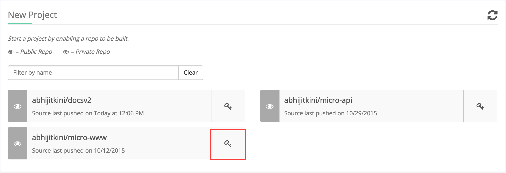
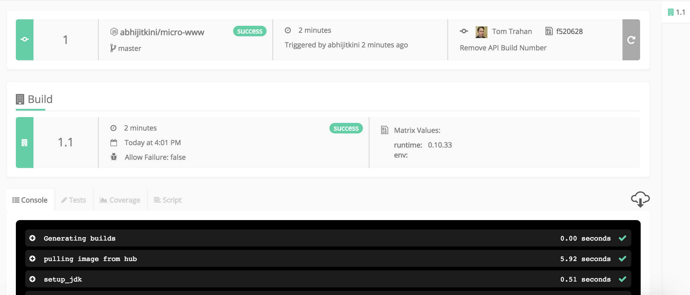

page_title: Running your first sample build
page_description: Setup up documentation for a sample build
page_keywords: getting started, build, quick start, documentation, shippable, continous integration, MT-CI

# Running a sample CI build
This guide walks through the process of running a sample build for **Shippable MT-CI (Multi Tenant - Continuous Integration)**. A NodeJs sample application (Aye0Aye) is leveraged

## Pre-requisite
Fork the following GitHub repository in order to complete the tutorial

- Sample app: <https://github.com/aye0aye/micro-www> 

## Sign into Shippable
- Login to [Shippable](<http://www.shippable.com>) using your source code system. For this tutorial GitHub is used. 

## Enable a Repo
To enable the forked repository for Shippable's CI, activate the re on the ‘New Project’ page (Note: if you haven’t enabled any projects previously, you’ll be on the ‘New Project’ page automatically). Select the ‘+’ in the upper right of the Status page):

- Click on the  icon to the right of the header bar to enable the project/repos.
- This brings you to the page with the list of projects (**micro-www**) in your repo that are yet to be enabled.
- Click on the  icon to enable the project
- If micro-www repo is not showing up on the new projects list, click on the **force sync** icon in the Account Settings (top, right corner navigation bar)to sync your source code repo with Shippable.

## Run a CI build
- Your page should look like this

- Click on the "Play" icon to trigger your CI build 

## Successful CI build
Congrats, you have successfully run your build. A sample, successful build is shown below
