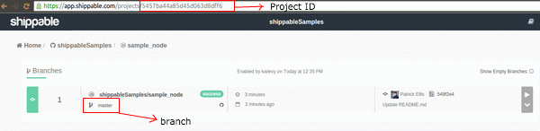

page_title: Build Badges
page_description: How To get build badges for your CI Project
page_keywords: build badge, build dashboard, CI/CD, shippable CI, documentation

# CI Build Badges

## Using Shippable API

You can use Build Badges to display the status of your most recent build on your GitHub or Bitbucket repo page using the API routes below:

- Go to your [Project dashboard](project_dashboard.md) on Shippable and retrieve your Project id as shown below

- In the example above, the project id is: `5457ba44a85d45d063d8dff6`

- You can now use the following routes to display the status of your project by branch:

For master branch:

`https://api.shippable.com/projects/5457ba44a85d45d063d8dff6/badge/master`

to get this:

For test branch:

`https://api.shippable.com/projects/5457ba44a85d45d063d8dff6/badge/test`

to get this:

## Using Shields.io

You can also use Build Badges via [Shields](http://shields.io):

Follow the steps above to get your Project id from the `url` for this example we will use the same project id: `5457ba44a85d45d063d8dff6`

For master branch:

`https://img.shields.io/shippable/5457ba44a85d45d063d8dff6.svg`

to get this:

For test branch:

`https://img.shields.io/shippable/5457ba44a85d45d063d8dff6/test.svg`

to get this:

