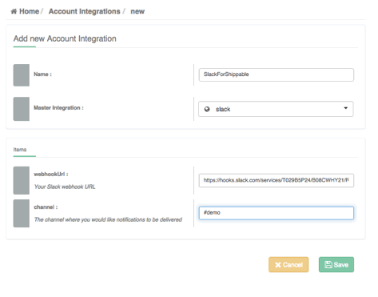
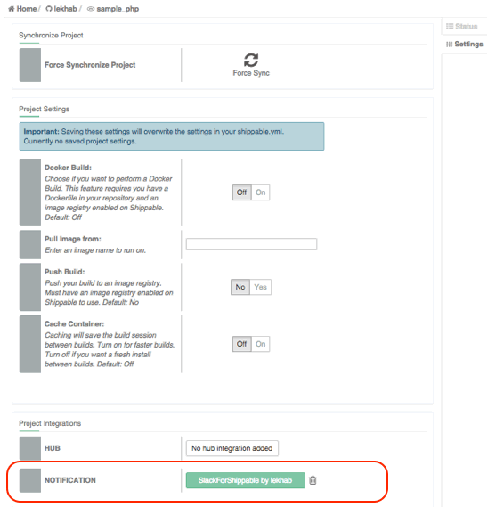

page_title: Slack Integration for Build Notifications
page_description: How to set up Slack Integration for Build Notifications
page_keywords: slack integration, build notifications, CI/CD, shippable CI, config, project settings, notifications

# Slack Integration for Build Notifications

This guide will walk through how to integrate Shippable with Slack, so you can get all Build related notifications on a Slack Channel.

You can also get your build notifications through [Email or IRC](yml_reference/#notifications).

Follow the three steps outlined below to enable Slack for build notifications:

## 1. Create an Incoming Webhook Integration on Slack

- First off, visit your Slack domain page here: ```https://your-slack-team-here.slack.com/services/new```. Scroll toward the bottom of the page to see an option for **Incoming Webhooks**. Click on the **View** button against this.


    


- Follow the prompts. It does not matter what channel you choose to publish to while setting it up on Slack. We will let you override that from Shippable anyway
- Note the "Webhook URL" that Slack generates. You will need this in the next step to set up your Slack account integration on Shippable

    


## 2. Set up an account integration on Shippable

- Login to Shippable and go to Account Settings

     

- Click on Integrations
- Click the  on the right to add a new integration
- Enter a name for your Slack Integration. This is what you will be referring to in the next step - so choose a name that's easy to remember
- Choose Slack as the Master Integration Type
- In the Webhook URL box, copy and paste the Webhook URL from your Slack integrations page
- Channel: Here, you can customize the channel to post notifications to. Channel names must begin with #, so if you want to post to general, be sure to specify #general as the channel name. You can also do direct messages to individuals by entering @username.

    


This step enables you to use this particular Slack Integration across any project you choose.

## 3. Enable the integration on a project

The last step is to enable the notification for your specific project.

- Go to the Project Page and click on the Settings tab
- Scroll down to the Project Integrations section
- Against Notifications Integration, select the name of the integration you created in Step 2. In the example below, ```SlackforShippable``` is used as the integration for my ```sample_php``` project.

    

And that's it. You should now get build notifications related to this project on the Slack Channel like the one I got below for the ```sample_php``` project.


