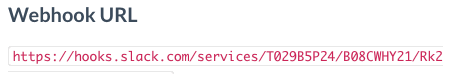

page_title: Slack Integration for Build Notifications
page_description: How to set up Slack Integration for Build Notifications
page_keywords: slack integration, build notifications, CI/CD, shippable Continous Integration, config, project settings, notifications

# Slack Integration for Build Notifications

This guide walks through the steps to integrate Shippable with Slack, to enable all Build related notifications on a Slack Channel.

You can also get your build notifications through [IRC](ht_irc_notifications.md) or [Email](oe_yml_reference/#email-notifications).

Follow the three steps outlined below to enable Slack for build notifications:

## 1. Create an Incoming Webhook Integration on Slack

- Visit your Slack domain page here: ```https://your-slack-team-here.slack.com/services/new```. Scroll toward the bottom of the page to see an option for **Incoming Webhooks**. Click on the **View** button against this.


    


- Follow the prompts. The channel you choose to publish at this step can be anything on Slack. You can override it from Shippable anyway
- Note the "Webhook URL" that Slack generates. You will need this in the next step to set up your Slack account integration on Shippable

    


## 2. Set up an account integration on Shippable

- Login to Shippable and go to *Account Settings*

     

- Go to the *Integrations* tab & click on *Add Integrations* to add a new integration


- Select ***Slack*** from the list of drop down options under *Master Integrations*
- Name: Enter a name for your Slack Integration. This is what you will be referring to, in the next step - so choose a name that's easy to remember. In this example, ***SlackForShippable*** is used
- Webhook URL: Copy and paste the Webhook URL from your Slack integrations page
- Channel: Specify the channel where you want to post notifications. Channel names must begin with #. For example, to post notifications to a channel called general, specify #general as the channel name. You can also configure direct messages to individuals by entering @username.
- Click *Save* 


This setting enables you to use this particular Slack Integration across any project you choose.

## 3. Enable the integration on a project

The last step is to enable the notification for a specific project.

- In Shippable, go to the *Project Page* and click on the *Settings* tab

NOTE: Do ensure you are looking at the Project page & not the subscription. If you are in the right place, the URL should look similar to this ````https://app.shippable.com/projects/565f850d1895ca447449633d````


- In the *Settings* tab, scroll down to the *Integrations* section
- In the dropdown options for *Notifications Integration*, select the name of the integration you created in Step 2. In the example below, ```SlackforShippable``` is used


And that's it. You should now get build notifications related to this project on the Slack Channel like the example shown below for the ```micro-www``` project.


