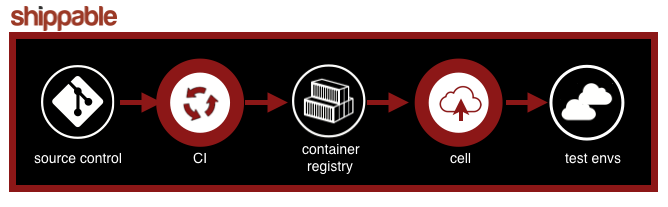

page_title: Learn About What Makes Shippable Great
page_description: Code examples, FAQs, language & platform support
page_keywords: containers, lxc, Docker, Continuous Integration, Continuous Deployment, CI/CD, testing, automation

# What is Shippable?

Shippable was founded so that software development teams could accelerate their release cycles by automating the build, test and deployment of applications. Our Continuous Delivery pipeline takes your code from from source control to production, without the need for configuration management/IT automation tools or infrastructure code.

We integrate with the tools and technologies you use today and will need tomorrow, like GitHub, Bitbucket and on-prem repositories, offer seamless deployment to private clouds as well as leading cloud providers including Amazon and Google, and support all application architectures from enterprise grade multi-tier to containerized micro services. 

If you believe that your team should focus on product innovation instead of building complex deployment pipelines, you should sign up for Shippable today.

The Shippable platform consists of 2 parts: 

**Continuous Integration (CI)**, which enables teams to build and test their repositories for every code commit or pull request and get instant feedback. 

**Continuous delivery pipelines** which automate the flow of your application from source control to production. Using these deployment pipelines, you can easily deploy containerized applications to Container Services like Amazon's ECS and Google Container Engine. 

Shippable integrates with all popular tools and services, such as build/test tools,  source control providers, docker registries, cloud providers, and container services.

## Continuous Integration
Our Continuous Integration platform helps developers find bugs as soon as they are introduced. Every time you commit code or open a pull request, your code will be automatically built and tested and you will receive a notification with build results. 

We run all your builds on **minions**, which are Docker-based containers. If you're using Docker for development, you can use your own Docker images or even build a Docker image and run builds in the container as part of your CI workflow. For customers who are not using Docker for their development, we provide a variety of images for each language that are pre-loaded with popular services and tools.

You should use Shippable for Continuous Integration if you fit the following profile -

* Your source code is on GitHub, Bitbucket or GitHub Enterprise. (Support for Bitbucket Server and Gitlab will be announced in Q1 2016)
* You want to avoid the time sink of setting up and managing your own CI system and would rather spend the time writing features for your product   
* (optional)You're a Docker user and you want to use your own custom image to run your builds. You can even run Docker compose to spin up environments!

Some customers are not comfortable or for some reason cannot run builds on our hosted infrastructure. To address this, we offer an additional feature called BYOH where you can run builds on your own infrastructure.

###Bring your own hosts (BYOH)
For customers who want complete control over their build hosts, we offer a novel approach called **Bring your own hosts (BYOH)**. 

BYOH lets you run builds on your own infrastructure, so you can attach your machines to your Shippable subscription and all your builds are routed to those machines. This is a powerful hybrid approach that gives you the benefit of using a SaaS service for CI orchestration, while still giving you full control over the infrastructure and security of your build machines.

You should take advantage of BYOH if:  

* You want complete control over your build machines. 
* Your builds are resource intensive and 2 core, 4GB RAM is not sufficient to run them. You need bigger containers! 
* You want your build machines to be inside your VPC and/or behind your firewall, which also gives you the ability to configure access, IAM, etc.

Go to [the Continuous Integration section](ci_overview.md) to learn more.

## Continuous Delivery pipelines

Our powerful deployment pipelines give software development teams the ability to automate the flow of their Docker based applications from CI to a versioned deployment unit which can then be easily and automatically deployed to Container Services like Amazon's ECS or Google Container Engine. Your application components are versioned and individual deployment units, which we call Cells, can be upgraded or rolled back with a single click. We also support auto-deploying to test environments, which means your functional tests can be automated to run on every code commit.
 
Most importantly, our deployment pipelines give you the ability to be cloud agnostic. You can move your applications across Container Services in a few minutes!

You should Shippable to set up your Continuous Delivery pipelines if you fit the following profile -

* Your application is Dockerized and you run Docker in test environments and Production, or
* You do not use Docker in production, but run (or are open to running) your Test and/or Production environments on a Container Service, or 
* You are not using Docker in production but are interested in containerizing your Test environments.  
* You run (or want to run) functional tests for every code commit

Go to [the CD Pipelines section](pipelines_overview.md) to learn more.

In addition, we also have a cool tool called **Lighthouse** that lets you monitor any Docker images you depend on and be notified when they change. This helps avoid situations where your images no longer work due to changing dependencies. 

Go to [Lighthouse Overview](lighthouse.md) to learn more.

*****

