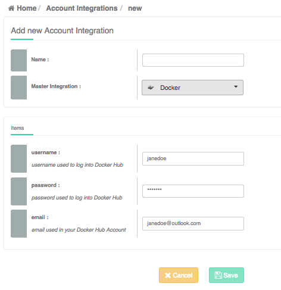
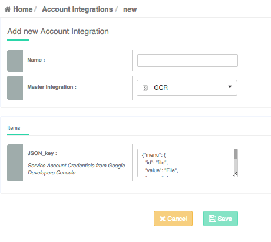
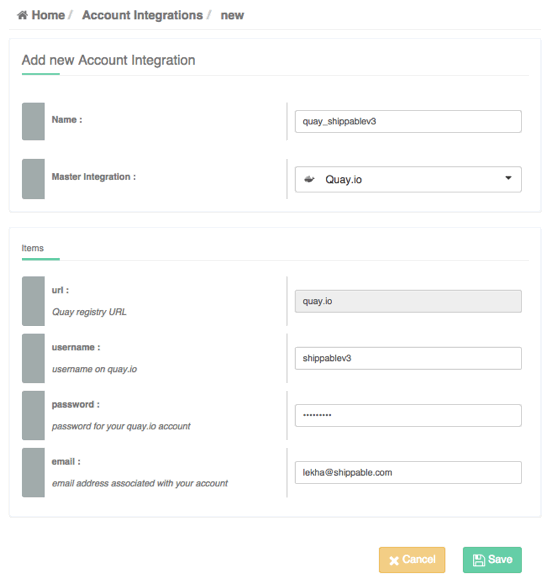

page_title: Shippable Integrations
page_description: Integratons with Dockerhub, GCR, lighthouse
page_keywords: containers, lxc, docker, Continuous Integration, Continuous Deployment, CI/CD, testing, automation, Tokens, account settings, integrations, docker hub, gcr, quay.io, private registry,lighthouse

# Integrations

This page describes the different integrations you can set up for your account. These are set up once for each type of integration and can be re-used in different parts of the Shippable pipeline.

## How do you get here?

- Login to [Shippable](http://shippable.com)
- Click on the Account Settings icon on the top nav bar

     

- Select the **Integrations** tab

------

## Add a New Account Integration

To add a new integration, click on 

-------

### Docker Hub

You will need this to pull or push images to Docker Hub as part of building your project.

1. Click on Account Settings in the top navigation bar and select the Integrations tab
2. To add a new integration, click on 
3. **Master Integration:** On the dropdown, Choose `Docker`
4. **Integration Name:** Use a distinctive name that's easy to associate to the integration and recall. `Example:docker-mydockerusername`
5. Enter your credentials
6. Click on `Save`

The integration will now be available to all your projects. To learn more about where this integration is used, check out our [Docker Registries Guide](docker_registries).

--------

### Google Container Registry (GCR)

You will need this to pull or push images to Google Container Registry as part of building your project.

1. On the [Google Developers Console](https://console.developers.google.com/), select the project you want to integrate with Shippable
2. In the sidebar on the left, expand 'APIs & auth' and select 'Credentials'
3. Click 'Create new Client ID' and select 'Service Account' in the pop-up window
4. Click on 'Create Client ID'. A dialog box appears. To proceed, click 'Okay, got it'
5. Your new Public/Private key pair is generated and downloaded to your machine. Please store this carefully since you will not be able to retrieve this from your GDC account.
6. Now you are ready to integrate with GCR on Shippable. Back to [Shippable](https://shippable.com).
7. Click on Account Settings in the top navigation bar and select the Integrations tab
8. To add a new integration, click on 
9. **Master Integration:** Click on `GCR`
10. Enter a name for your integration. Use a distinctive name that's easy to associate to the integration and recall. `Example:gcr-gcrusername`
11. Enter your JSON key that you saved earlier
12. Click on `Save`

The integration will now be available to all your projects. To learn more about where this integration is used, check out our [Docker Registries Guide](docker_registries).

### Quay.io

You will need this to pull or push images to Quay.io as part of building your project.

1. Click on Account Settings in the top navigation bar and select the Integrations tab
2. To add a new integration, click on 
3. **Master Integration:** On the dropdown, Choose `Quay.io`
4. **Integration Name:** Use a distinctive name that's easy to associate to the integration and recall. `Example:quay-myquayusername`
5. Enter your credentials
6. Click on `Save`

The integration will now be available to all your projects. To learn more about where this integration is used, check out our [Docker Registries Guide](docker_registries).

### Private Registry

Use the following steps to create an integration to a private registry from where you would like to pull or push images. The example below uses Quay.io as an example of a private registry - you can replace it with the URL specific to your private registry.

1. Click on Account Settings in the top navigation bar and select the Integrations tab
2. To add a new integration, click on 
3. **Master Integration:** On the dropdown, Choose `Private Docker Registry`
4. **Integration Name:** Use a distinctive name that's easy to associate to the integration and recall. `Example:MyPrivateRegistry`
5. Enter your credentials
6. Click on `Save`

The integration will now be available to all your projects. To learn more about where this integration is used, check out our [Docker Registries Guide](docker_registries).

------------

### Lighthouse Notification

This is the integration that is used to set up email notifications for Lighthouse, our image monitor. To learn more about lighthouse, go [here](lighthouse.md)

1. Click on the Account Settings and select the Integrations tab
2. To add a new integration, click on 
3. **Master Integration:** Click on `Email`
4. Enter a name for your integration. Use a distinctive name that's easy to associate to the integration and recall. Example: `Example: my-shippable-emailid`
5. Enter your email address: `janedoe@shippable.com`
6. Click on `Save`

You can now use this integration to send update emails to the email id when an image gets updated.

## Delete an Integration

Before deleting an integration, make sure there are no dependencies. In other words, no downstream projects should be using this integration. Remember, the integration may be used by folks added to your subscription if your GitHub Account is an Organization.

Delete will fail if there are any projects actively using the integration.

To delete an integration:

- Click on the  next to the integration.
- Scroll down and click on the **Delete** button.
