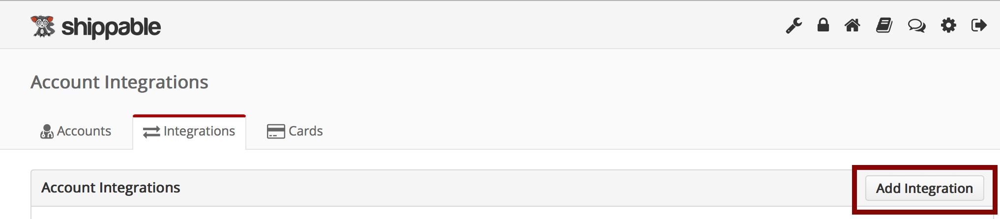

page_title: Shippable CI Overview
page_description: Code examples, FAQs, language & platform support
page_keywords: containers, lxc, docker, Continuous Integration, Continuous Deployment, CI/CD, testing, automation

# Third-party integrations

Shippable integrates with many popular source control providers, notification platforms, container services, and Docker registries.

In order to interact with these services on your behalf, you need to provide your credentials or keys. To protect this private information, we do not ask you to enter this in the yml config, and instead provide an easy way to set this information in the Shippable UI.

For example, to pull an image from or push an image to a Docker Hub, you will add a Docker integration which will ask for your credentials and you can then use that integration during your build process.

To start with, you will always need to add an account integration as described below.

##Adding an account integration

- Click on the 'Account Settings' icon on the top right hand corner of Shippable portal.

- Click the 'Integrations' tab and then click 'Add Integration'

- Use the dropdown to select the desired integration and proceed with the configuration of that specific integration.

- Click on `Save`.

The integration should now show up in your `Integrations` tab. This integration will be available to all your projects and can be used for your workflows. Further details and examples of how a specific integration is used is available in the section for each integration.

---

## Deleting an account integration

To delete an integration:, simply click on the `Delete` button for the integration you want to delete.

Delete will fail if there are any projects actively using the integration, so make sure the integration is not being used in any project before deleting it.

---

## Supported integrations

### [Source Control Providers](int_scm.md)
-  [GitHub](int_scm/#github)
-  [GitHub Enterprise](int_scm/#github-enterprise)
-  [Bitbucket](int_scm/#bitbucket)
-  [Bitbucket Server](int_scm/#bitbucket-server)
-  [GitLab](int_scm/#gitlab)

### [Docker Registries](int_docker_registries.md)
- [Docker Hub](int_docker_registries/#docker-hub)
- [Amazon EC2 Container Registry (ECR)](int_docker_registries/#amazon-ec2-container-registry-ecr)
- [Google Container Registry](int_docker_registries/#google-container-registry-gcr)
- [Quay](int_docker_registries/#quayio)
- [Docker Trusted Registry](int_docker_registries/#docker-trusted-registry)
- [Any private registry](int_docker_registries/#private-registry)

### [Container Services](int_container_services.md)
- [Amazon EC2 Container Service (ECS)](int_container_services/#amazon-ec2-container-service-using-account-keys)
- [Google Container Engine (GKE)](int_container_services/#google-container-engine-gke)
- [Docker Cloud](int_container_services/#docker-cloud)
- [Docker Datacenter](int_container_services/#docker-datacenter)
- Microsoft Azure (coming soon)

### [PaaS/IaaS Providers](int_paas_iaas_providers.md)
- [AWS Elastic Beanstalk](int_paas_iaas_providers/#aws-elastic-beanstalk)
- [AWS Opsworks](ht_opsworks/)
- [Heroku](ht_heroku/)
- Red Hat Openshift (coming soon)
- [AWS EC2 (using CodeDeploy)](ht_codedeploy/)
- [Digital Ocean](ht_digitalocean/)

### [Notifications](int_notifications.md)
- [Slack](int_notifications/#slack-notifications)
- [IRC](int_notifications/#irc-notifications)
- [Email](int_notifications/#email-notifications)
- [HipChat](int_notifications/#hipchat-notifications)

### [Keys](int_keys.md)
- [SSH keys](int_keys/#ssh)
- [PEM keys](int_keys/#pem)

---
