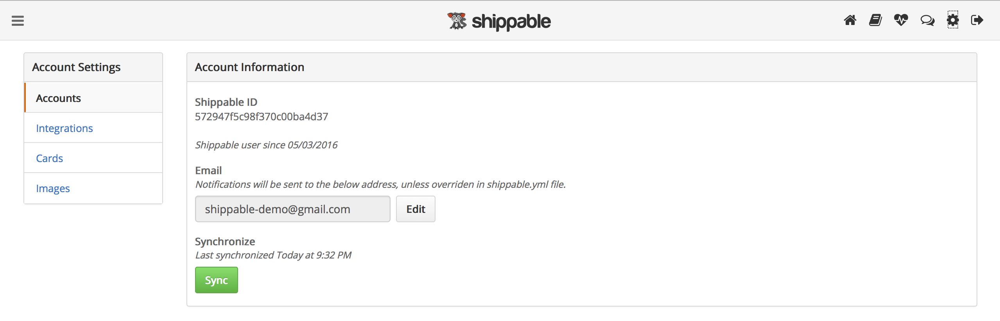

page_title: Navigating Shippable's Account Settings UI
page_description: Overview of Shippable's Account Settings UI
page_keywords: User Interface, microservices, Continuous Integration, Continuous Deployment, CI/CD, testing, automation, pipelines, docker, lxc

#Account Settings
Get to your account settings by clicking on the gear icon in the top navigation bar when you are logged in to Shippable.

---
The Account Settings contains the following sections:
##Accounts
### Account Information

**Shippable ID:** This is your Shippable account id.

**Email address:** When you sign up, we set to the primary email address of the source control provider account you use to sign in to Shippable as the default email for sending notifications.

You can override this default by clicking on the `Edit` button and entering a new email address. You will start receiving all subsequent notifications at the address you configured.
Please note that once you change this, you cannot undo this action.

**Synchronize** We periodically sync your Shippable account with your source control provider. This section will show you the last time your account was synced.

You can use the `Sync` button to sync your account at any time if you want to see any changes immediately.

For example: You are added to an organization on GitHub as an owner/collaborator, or  you have new repos in GitHub and want to see them immediately, or you linked your Bitbucket account to this account and want to see your Bitbucket repositories right away.

### Git Identities

This sections shows you which source control identities are connected to your Shippable account. You can connect both GitHub and Bitbucket accounts to one Shippable account and get a consolidated view of all your projects.

**GitHub**

If you've signed in using your GitHub account, your GitHub identity will either be: (public) or (public and private)

(public) means that we have permissions to your public Repos but not your private repos. This is the default setting since signing in to Shippable requires you to authorize this access on GitHub.

(public and private) means that Shippable has access to your public and private repos. You need to enable this if you want to build private repositories.

The `Enable` button is a one way toggle - once you enable private repository permissions, you cannot revert back to just public repository permissions using the Shippable UI.

Even if you use Bitbucket credentials to sign in, you can click the `Enable` button for your GitHub identity to connect your GitHub account. This will give you a consolidated Shippable account where you can build projects from both source control providers and also set up deployment pipelines.

**Bitbucket**

If you signed in using your Bitbucket Account, your Bitbucket identity will be shown in this section. Bitbucket does not support granular permissions to public and private repo access, so access for both is turned on by default when you sign in and authorize Shippable to access Bitbucket.

Even if you use GitHub credentials to sign in, you can click the `Enable` button for your Bitbucket identity to connect your Bitbucket account. This will give you a consolidated Shippable account where you can build projects from both source control providers and also set up deployment pipelines.

### Delete Account

The `Delete your account` button lets you delete your Shippable account. You will need to confirm that you want to delete all dependencies like enabled projects, account integrations, etc.

Your account will be deleted immediately if you choose to complete this action.

Please note that deleting your account does not delete Organization subscriptions since these are shared by multiple users. If you sign in to Shippable again at a future time, you will still see projects and builds for organizational subscriptions. If you want to stop using Shippable for organizations, you can always revoke access in your GitHub account settings.

---

##Integrations
Shippable integrates with many third party services/platforms and you can leverage this by setting up an account integration and then using the integration at any point in your Shippable Continuous Integration or Delivery workflows.

This section lists all the integrations that have been added by this account. The information displayed for existing integrations are:

- Type: Icon representing the third party integration
- Name: Integration name defined at the time of creating the integration
- Master Name: Official name of the third party integration
- Master Type: Indicates the type of integration. The types are: scm (Source Control Management), Hub (Docker registries), Deploy (Container services, IaaS/PaaS providers), notification (Slack, email, Hipchat, etc.) and keys (SSH, PEM)
- Updated At: Displays the date the integration was updated
- `Edit` button: Edit the integration
- `Delete` button: Delete the integration

###Adding an account integration

- Click on the 'Account Settings' icon on the top right hand corner of Shippable portal.

- Click the 'Integrations' tab and then click 'Add Integration'

- Use the dropdown to select the desired integration and proceed with the configuration of that specific integration.

- Click on `Save`.

The integration should now show up in your `Integrations` tab. This integration will be available to all your projects and can be used for your workflows. Further details and examples of how a specific integration is used is available in the section for each integration.

---

### Deleting an account integration

To delete an integration: Simply click on the `Delete` button for the integration you want to delete.

Delete will fail if there are any projects actively using the integration, so make sure the integration is not being used in any project before deleting it.

---

##Cards
You need to add your credit card information to your account in order to use the card to pay for a Shippable subscription.

The Cards section will show you all the credit cards linked to your account.

###Adding a card

Click on the `Add Card` button to add a new card and follow instructions to save the card to your account.

You will not be charged until you use a card to upgrade a subscription.

###Removing a card

Click the `Delete` button for the card you wish to remove from your account.

---

##Images
This section allows you to monitor Docker images and be notified of updates to the images at no cost.

Read the ["How to monitor your Docker Images"](../../tutorials/how_to_monitor_docker_images) section for further details.

---

##API Tokens
This is where you generate, view and manage access tokens to use our [API](../../api).

###Adding a token
To add a token:

- Click the 'Add Tokens' button.
- Enter a token name and click on `Add` to create a new token.
- IMPORTANT: Remember to copy the token. For security reasons, the token will never be displayed again.

###Deleting a token
To delete a token, click on the `Delete` button next to the token you want to delete.

**Please remember to keep your token safe and do not share it with anyone.** If anyone gets access to your token, they will be able to make API calls on your behalf and compromise the security of your Shippable account. Treat your API token like a password.

---
